# **Creating the Environment**

### 1. Download the repository
> `git clone https://github.com/Coding-daredevil/APPeatizer.git`
### 2. Download [Anaconda Individual Edition](https://www.anaconda.com/products/individual)
 * The project was developed in a virtual environment in Anaconda, on Windows. There are two ways to recreate the environment, an automatic and a manual one.
    1. The automatic creation of the environment is done through the command: conda env create -f environment.yml 
    2. To manually create the environment:
        * conda create -n tf tensorflow-gpu==2.6.0 python==3.7.10          (if no gpu available, remove -gpu)
        * conda activate tf
        * pip install packages in _requirements.txt_
    * **Note #1:**  Extremely important to not forget to downgrade keras to **2.6.0** version in case of manual creation!
    * **Note #2:**  The current **environment.yml** was created on **Ubuntu 20.04**, therefore this command will **not** run properly on Windows.
### 3. Download [MongoDB](https://www.mongodb.com/try/download/community)  
 1. Download and install MongoDB DataBase Tools (same page)
    * Installation guide for tools: [Guide Link](https://docs.mongodb.com/database-tools/installation/installation/)
 2. After installation we download the backup_db from [google drive](https://drive.google.com/drive/folders/1I4CIOLShBJ2Ql_zv2LQpjBRu0uWahckr) and place it on the appropriate folder.
 3. With the command below, we can restore the database (local host): 
    * mongorestore -d accounts backup_db/accounts.

## **Structure & Configuration**
----------------------------

  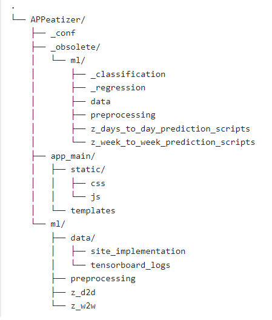

### The repository can be broken down into **three main parts**:
1. The **_obsolete** folder.
    * Contains **everything** relative with experimenting on the **MyFitnessPAL** dataset. Does not affect the application in any way.
2. The **ml** folder.
    * Contains **everything** relative with machine learning on the **Applications**.
3. The **app_main** folder.
    * Contains **everything** relative with the **Application** minus the _machine learning_ aspect.
### Regarding the Configuration File
1. Most fields should be used by default (unless strongly desired otherwise). The following however are an exception:
    * [Flask][api_key]: _Each Flask web application contains a secret key which used to sign session cookies for protection against cookie data tampering. It's very important that an attacker doesn't know the value of this secret key._
    * [MongodDB][:]: _MongoDB was set to run on a local machine. If you desire to change this, then you may tweak the values accordingly. The dbname is the name of your database. If downloading the above folder, you need to **keep** this as accounts._
    * [Edamam][:]: _EdamamAPI requires some keys you will need to create. You may follow this [Developer Edamam](https://developer.edamam.com/edamam-nutrition-api) for more information, as well as [RapidAPI](https://rapidapi.com/edamam/api/edamam-nutrition-analysis)._
        * **NOTE:** You will need **3** keys. The reason is that each key will allow a total of **100** logs per day, which are not enough when data was collected during August-September of 2021. The system in place uses the keys interchangeable to allow a total of **300** logs.
    * [Ml][:]: _You may tweak parameters as desired. However, we followed the following methodology: We increased batch size on training the entire 308+56=364 models to 256/128/64 (training,validation,test) and we reduced it to 32/16/8 for training the website models in order for better generalization to be achieved. In that regard, L2 regularization has been used. Generally speaking, the rough estimate is indeed accurate by the 364 high-batch size train models. Ideally, we would want to train all these models with the latter parameters. Epochs likewise 100/300 (training all, training site model)._

## **First Run**
* Execute the following command in the console window: `python _first_run.py`
    * **HINT**: _Make sure mfp-diaries.tsv is in the appropriate folder as defined in the configuration file _`[original_dataset][tsv]`_
    * **NOTE**: _Each preprocessing file saves by default (configuration) on ml/._

## **Website Model Build**
-----------------------------
### **Execute** _update_model.py  
#### The below parameters need to be inserted upon execution (twice in total)
1. Data Preparation _(Suggested Parameters)_:  
    * `[1,11]` Selected Days: `3-5`.
    * `[1,4]` Selected Weeks: `2-3`.
    * `[1,7]` Selected Threshold: `2-4`.
    * `[0,1]` Append Site Data: If using a new database (or undesired) then select `0`.
2. Model Creation & Training (Both):  
    * `[0,2]` `1`: Only Training, `2`: Validating, `3`: Validating + Testing.
        * Suggested: `2` or alternatively, `1` for serving.
    * `[0,1]` Tensorboard Logs: Default `0`. 
    * `[0,1]` Decision between **Calorie Deficit Prediction** and **Lapse** at mean point. The first is a regression problem while the later one of classification.
        * Default parameter `0`.

> If the above steps are followed through, running the application should now be possible with *all* its features enabled. If this is your first run (starting from zero), follow the next segment.

## **Website Run**
-----------------------------
1. Run the following: `python waitress_app.py`

### Website Application Overview
* We either sign or create new account. _Below is my testing email for the period of Aug-Sep 21, containing around 1 straight month of data._
    * Main-Email: `boulias@ceid.upatras.gr`
    * Main-Pass: `admin`
* We are re-directed to the Dashboard. From left to right:
    1. `Interactive Dietbook` grants access to the dietbook where we can log our intakes.
    2. `Access patients Dietbook` grants access to patients' dietbooks through a list.
    3. `Request Prof. Supervision` links our account to that of the email given.
    4. `Edamam Implementation` offer simple, on the go queries for calories.
    5. `Personal Information` is where we log our personal information.
        * If you are a new user, it is suggested you enter here first and log in your data!

### First Use Scenario
1. We create an account.
2. We log our 'Personal Information' (last card in the dashboard).
3. We click on 'Interactive Dietbook'
4. To log fast (or have an overview) we can use the default 'Week-View'.
    * In this case, we can only log intakes.
5. To open up all available logging options, we click 'Expand Day' on our desired day.
    * Here we can again log our intakes (--insert new element here--).
    * We can see the calorie consumption and nutritional value.
    * We can tick Exercised? if we exercised and if we know how many calories we burnt, we can log that too. This also accepts text (drop down list).
    * We can also fill Hunger Before/Hunger After/Mood/Company/Filled Just Before or Right After?/Weight Measurement
        * These are not taken into consideration during the ML process, as the dataset used is essentially a subset of what our application offers. Ideally,
     we would have that much data for logs in the application and be able to use all these user (age,weight,etc) and intake (foods, cals, carbs, etc) features
     to our system.
6. We can ask for a day/week prediction with the respective buttons. In that case, depending on how we trained our model (number of days/weeks used to make prediction),
that many past days will be taken into consideration at predicting the one selected. If previous days do not contain enough data, an error message will be printed on
screen (alert).
#### Additionally
1. We can log our supervisor in 'Request Professional Supervision'. We simply add their email (email has to exist in our database as a registered user).
2. If we are the supervisor we can access patients' dietbooks from 'Access Patient Dietbooks' (VIEW ONLY mode currently implemented).

### How to log intakes
EdamamAPI utilizes NLP capabilities, so unless we are completely off a rough description of what we ate/drunk will suffice. If our input is off, 
'Wrong Input Given' will appear on the screen. If we want to delete an input, we give press 'del' as input.

    '100ml beer' works, as does '1 big glass of beer'

**Warning**: 'Wrong Input Given' is **still** a query to the EdamamAPI and counts towards the **daily limit**.

# **System Architecture**
All things considered, you now have a small idea of what this application is all about. Followingly, we will explain some of the key concepts, so you can do some experimenting on your own. First and foremost, we will be taking a look at the **Datasets**, **Data Flow** and our **models' architecture**.

## **MyFitnessPAL Dataset**
### The Final (after preprocessing) Base Dataset
* **columns**: `['USER_ID', 'DATE', 'LOGS', 'RAW_CAL_OCC', 'TOTAL_CALS', 'TOTAL_CARB', 'TOTAL_FAT', 'TOTAL_PROT', 'TOTAL_SOD', 'TOTAL_SUG', 'GOAL_CALS', 'GOAL_CARB', 'GOAL_FAT', 'GOAL_PROT', 'GOAL_SOD', 'GOAL_SUG', 'DEFICIT_CALS', 'DEFICIT_CARB', 'DEFICIT_FAT', 'DEFICIT_PROT', 'DEFICIT_SOD', 'DEFICIT_SUG']`

  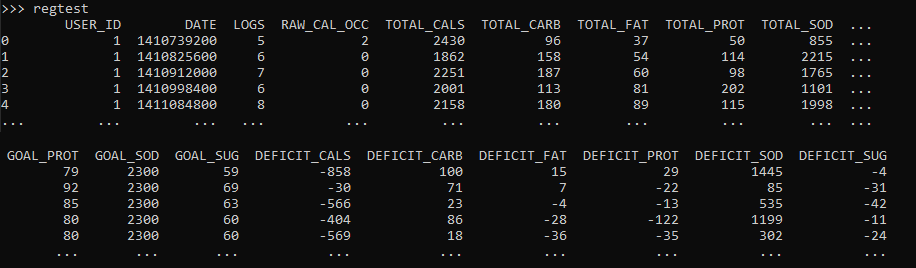

### The Final (after preprocessing) Advanced Dataset
* **columns**: `['USER_ID', 'sequence_name', 'sequence_cals', 'sequence_carb', 'sequence_fat', 'sequence_prot', 'sequence_sod', 'sequence_sug']`

  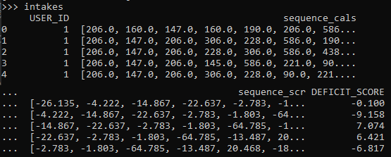

  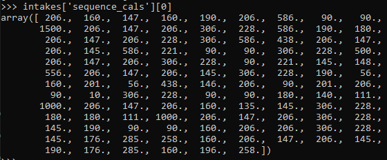

## **Data Flow**

  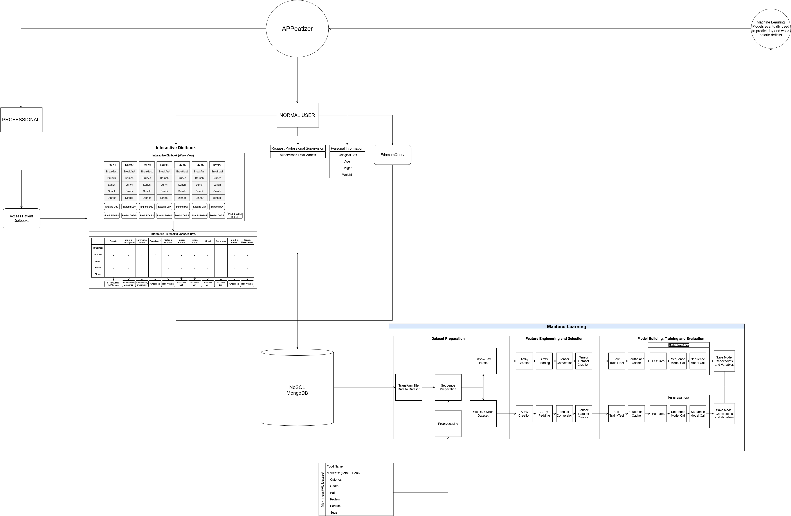

* The user has access to the main features of the website, such as their Interactive DietBook, Personal Information, etc. Professionals may access the DietBooks of their patients through the appropriate card. 
    * When a user performs an action, like logging their intakes, the web-site takes their data and stores them in MongoDB, depending on the type of action. 
    * Trained models work to help the user by making impactful predictions, such as their predicted calorie deficit tomorrow or alternatively, whether they are about to lapse or not. 
        * The calorie deficit aims to depict how much the user deviates from their goals and it is calculated as follows _100*((Goal-Total)/Goal)_. 
        * Lapse can be set to be the point between positive and negative deficit, however this will lead to a high baseline accuracy as the dataset used in such applications is often biased. In our experiments we predict at around $50\%$ baseline accuracy to better be able to see the potency of our model and that is why, at least for the site implementation we prefer using deficit prediction. 
        * The machine learning models are loaded at the beginning and data flows towards its storage in the MongoDB database. At an offline-point we can update our models on the new data and resume activity.

## **The main Concepts**
The system expands upon two concepts. These are:
* **`Day(s) to Day Prediction`**:
    * We use previous days to make predictions about the next.
* **`Week(s) to Week Prediction`**:
    * We use previous weeks to make predictions about the next.

## **Parameter Explanation**
When running scripts, certain inputs might be required. These consist of:
### Main Parameters
1. Keep/Jump variation (refered to as `Keep/Jump`)
    * `Keep` sub-variation follows the logic of 'keeping' data after each iteration. Essentially, if we use the first three 3 days to predict the 4th, we continue from day 2 onward (2-4 to predict 5).
    * `Jump` sub-variation follows the logic of 'jumping' over data after each iteration. Compared to the example above, we would continue from day 5 and not 2.
2. Days/Weeks taken into consideration (refered to as `TIC`)
    * You may choose as you wish, although values in the mid range are probably the best combination of good results and reliability.
    * Days from 1 to 11, Weeks from 1 to 4
3. Logging Threshold (refered to as `LogT`)
    * This parameter purges the dataset from raws containing less logs than its value. Its value ranges from 1 to 7.
    * You may again choose as you wish but likewise, values in the mid range are probably the best combination of good results and reliability.
4. Choosing between Deficit and Lapse prediction.
    * Deficit Prediction (Regression) predicts the deficit % in calories of the next day/week.
    * Lapse prediction (Classification) predicts between two classes, which we differentiate by targeting the 50% baseline point (mean of the label).

* Overall this leads to about **308** possible models for the Day(s) to Day variation and **56** models for the Week(s) to Week variation.  
    * The `_obsolete` folder essentially exists for us to perform tests on all possible models and select the best to use in the application.
### Secondary Parameters
1. Data Split
    * `0` uses only a Training set.
    * `1` uses Training and Validation set.
    * `2` uses Training, Validation and Testing set.
2. Tensorboard Log
    * `0` does not keep logs for Tensorboard.
    * `1` keeps logs for Tensorboard.
3. Append Site Data
    * `0` does not append site data.
    * `1` appends website data.

* These parameters exist exclusively for the application. The `_obsolete` folder always uses Training, Validation and Testing sets, never logs for Tensorboard and does not associate itself with the application at all! Followingly we will take a look at our model architecture.

  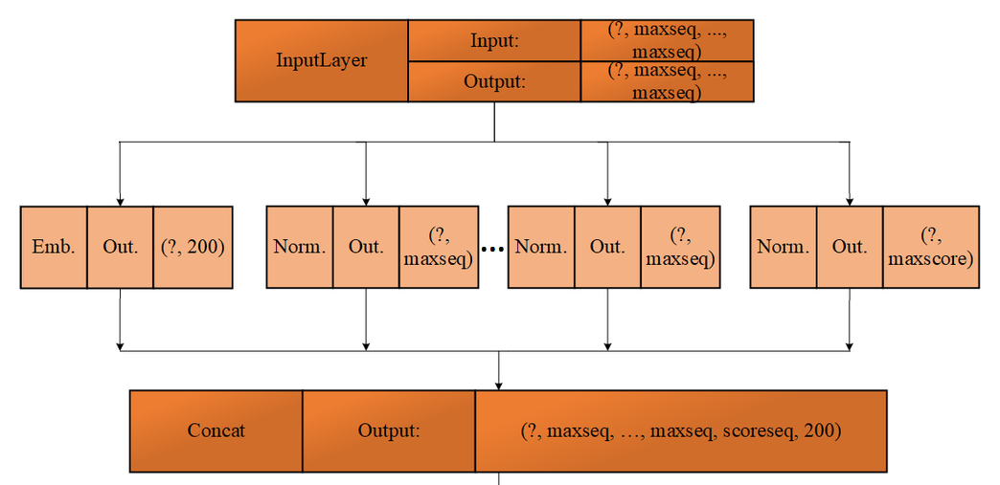

* Our approach to the problem is as follows:
    * MyFitnessPAL dataset includes some nutrient information:
        * UserID
        * Calories
        * Carbs
        * Protein
        * Fat
        * Sodium
        * Sugar
    * After performing various ehancements and feature engineering (e.g. logs per day which `logT` is based upon), rather than straight-out using values (e.g. Carbs=150), we opted to break down these intakes into arrays.
        * For example, supposedly one ate five times per day. His calories will become a numpy array of `[200, 350, 400, 100, 800]`. Likewise for the rest nutrients.
    * After selecting our parameters (`TIC, LogT, etc`), we combine those arrays appropriately.
        * For example, if `TIC` was 3 on the Day(s) to Day variation we combine the arrays of the `3` previous arrays to predict the next. These huge chunks are eventually 'fed' into the model, together with the user ID as well as the `Deficit Score`.
    * The `Deficit Score` is a feature we engineered. Its formula is _100*((Goal-Total)/Goal)_ and calculates how off or better (percentage wise) from our goals we are. For example, a man with a caloric goal of 2000 and a `deficit score` of 25%, has consumed 2000*0.75=1500 calories. Positive values are `good` outcomes, negative values are `bad` outcomes!  

* Essentially, the model's input is a combination of the above: 
    * The main field is an embedding of `IntegerLookup` type and contains (in integer form) the user ids. Following the past literature, we try to combine group-data with individual-data, something that is proven beneficial. 
    * The next six (`6`) normalization layers contain the nutrients in arrays (`Calories, Carbs, Protein, Fat, Sodium, Sugar`). Their size is depicted as `maxseq`, as we may train the model in a variety of manners and therefore the size will be affected. For example, if our prediction takes three (3) days to predict the deficit of the next, then if five (5) logs where made each day, each array has a length of `5x3=15`. However, since logs vary both per day and per user and since tensorflow requires a set array length, which we set to the `98th` percentile of the highest possible sequence in all of the dataset. We omit the last 2 percentile points to avoid unnecessarily big arrays and indeed, in practice, no disadvantages where noticed. 
    * The `maxscore` variable essentially depicts the amount of days used to make the prediction and the array itself includes the calorie deficits of each day. For example, if we take three (3) days to predict the next, then the score array might be `[25.10, 31.09, 12.50]`. 
* The eventual output size can be written as follows: `6*maxseq + maxscore + 200`.

  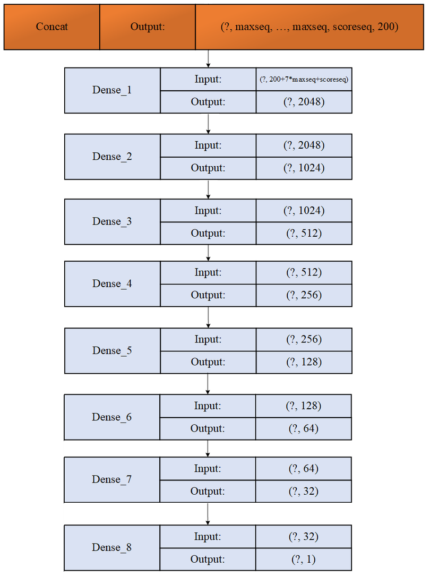

* The concatenated input is 'fed' into the dense layer network with the outcome either being the calorie deficit percentage (regression), or whether a lapse is predicted or not (classification). Of course, in the latter, alternative case a 'sigmoid' activator is used for the last Dense layer.

* `python ml/create_frame_plots.py`
    * This function will quickly print out the results of your models.
        * `[Days, Weeks]` depending on your preference. 
            * Accepts empty argument, defaults to `days`

# **Folder _Obsolete**
The obsolete folder contains all machine learning performed on the `MyFitnessPAL` dataset. These tests, as noted, where performed with the intent to find the best possible model for our application. You may replicate these experiments, or even better, when you make your alterations and incorporate your ideas, you may use it to figure out the best candidate.
* `python _obs_create_models.py`
    * Creates DataFrames on every possible `Days/Weeks`, `Keep/Jump`, `TIC`, `LogT` combination.
    * You need to manually select whether you want `Deficit` or `Lapse` prediction.
        * Once during the Day(s) to Day scenario and once during the Week(s) to Week scenario.
    * After creating the DataFrames, it will create models like the ones described above and train them.
        * No need for assigning parameters. Optimal settings have been selected.
    * Upon completion of fitting, the following will occur:
        * `Evaluation` on both cases (`Deficit/Lapse`)
        * Saving of `History` and `Metrics` dictionaries on both cases.
        * In the case of `Lapse`, we make **1000** predictions to roughly figure out a baseline accuracy and its difference with our model.
            * We avoid using the entire testing set because it will take too long even for one model, let alone 154/28.
            * These will be printed on screen
            * The `Accuracy` dictionary will be saved as well.

## What to do with those models
* `python _obsolete/ml/create_frame_plots.py`
    * Creates certain plots depending on circumstances. Easily navigatable. You may choose between:
        * `[Days, Weeks]` depending on your preference. 
            * Accepts empty argument, defaults to `days`
        * `[all, 1-7]` preference on LogT variable.
            * All option will create all plots together one on top of the other. Ideal to compare results.
            * Accepts empty argument, defaults to `'all'`
        * `[0, 1]` deficit/lapse prediction.
            * Accepts empty argument, defaults to `0`

### Day(s) to Day
#### Accuracy
---------------

  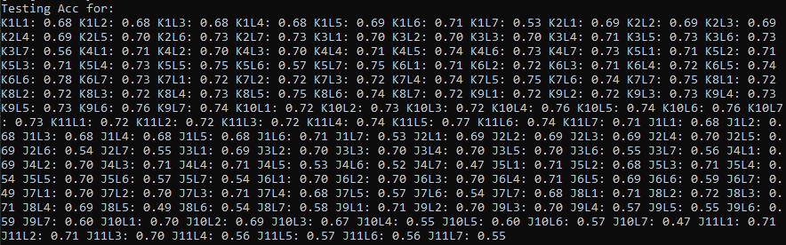

#### Deficit Error
---------------

  

### Week(s) to Week
#### Accuracy
---------------

  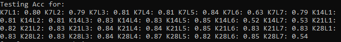

#### Deficit Error
---------------

  

## **Additional, Preliminary Tests**
* `python _obsolete/ml/_regression/regression.py`
    * A simple regression test where we try to predict calorie deficits through nutrient deficits. Our goal here is to re-affirm that nutrients can reliably estimate the amount of calories. Since we will be making predictions later on, it makes sense to at least know that what we are using is potent. 
    * No parameters, simply run!

  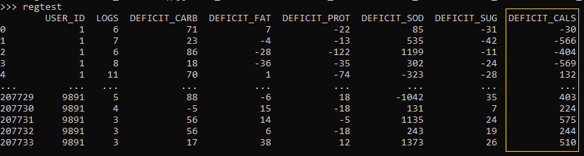

* `python _obsolete/ml/_classification/classification.py`
    * A simple 7-way classification where we try to group days into certain classes. Our goal again is to prove that it is possible to use nutrients to estimate how bad or how good days can be.
    * No parameters, simply run!

  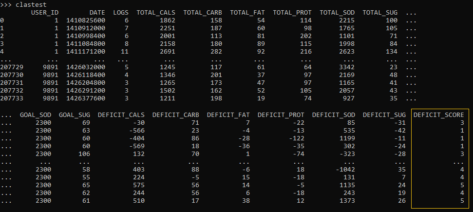

